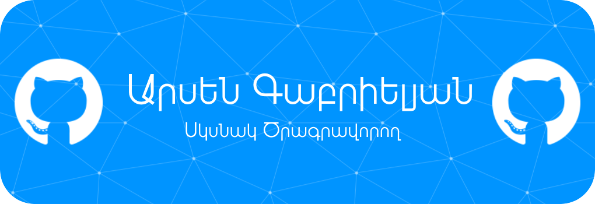

<h1 align="center">Բարև 👋, Ես Արսենն եմ</h1>

  
  
  
  
  

<h3 align="center">Սկսնակ Ծրագրավորող</h3>

- 🔭 Ես այժմ աշխատում եմ **ծրագրավորման վրա**
- 🌱 Ես այս պահին կատարում եմ **մի քանի հանձնարարություններ** և պատրաստում **մի քանի պրոյեկտներ**
- 📫 Ինչպես հասնել ինձ՝ **[Այցելեք իմ վեբ կայքը](https://arsen-2005.vercel.app/)**
- 🥅 Իմ նպատակն է **դառնալ Full Stack ծրագրավորող**
- ⚡ Ես սիրում եմ զբաղվել **լուսանկարչությամբ և այլ հոբբիներ**
- 👨‍💻 Բոլոր պրոյեկտները կարող եք ուսումնասիրել **[այստեղ](#blue_book-իմ-պրոյեկտները)**

### Լեզուներ և գործիքներ՝

---
  
### :zap: Ակտիվություն

<!--START_SECTION:activity-->
1. 🚀 Published release [Calm Mood Desktop v0.3.0](https://github.com/ArsenGabrielyan/calm-mood-desktop/releases/tag/v0.3.0) in [ArsenGabrielyan/calm-mood-desktop](https://github.com/ArsenGabrielyan/calm-mood-desktop)
2. 🚀 Published release [Calm Mood Desktop v0.2.1](https://github.com/ArsenGabrielyan/calm-mood-desktop/releases/tag/v0.2.1) in [ArsenGabrielyan/calm-mood-desktop](https://github.com/ArsenGabrielyan/calm-mood-desktop)
3. 🚀 Published release [Calm Mood Desktop v0.2.0](https://github.com/ArsenGabrielyan/calm-mood-desktop/releases/tag/v0.2.0) in [ArsenGabrielyan/calm-mood-desktop](https://github.com/ArsenGabrielyan/calm-mood-desktop)
4. 🚀 Published release [Calm Mood Desktop v0.1.0](https://github.com/ArsenGabrielyan/calm-mood-desktop/releases/tag/v0.1.0) in [ArsenGabrielyan/calm-mood-desktop](https://github.com/ArsenGabrielyan/calm-mood-desktop)
5. 🎉 Merged PR [#7](https://github.com/ArsenGabrielyan/webDevPractics/pull/7) in [ArsenGabrielyan/webDevPractics](https://github.com/ArsenGabrielyan/webDevPractics)
<!--END_SECTION:activity-->
  
---

### :blue_book: Իմ պրոյեկտները

<!-- REPOS-START -->
- [ArsenKids](https://github.com/ArsenGabrielyan/ArsenKids) - ⭐ 0 - 🎓 A standalone educational project with exciting games that make learning fun for children of the new generation
- [calm-mood](https://github.com/ArsenGabrielyan/calm-mood) - ⭐ 1 - 🌿 A standalone meditation app that helps you calm the human nervous system in case of stress, tension or depression.
- [calm-mood-desktop](https://github.com/ArsenGabrielyan/calm-mood-desktop) - ⭐ 1 - 🌿 A standalone wellness desktop app that helps you calm the human nervous system in case of stress, tension or depression.
- [cv-agir-community](https://github.com/ArsenGabrielyan/cv-agir-community) - ⭐ 2 - 📄 Interactive resume generator that has a QR code on each user-generated resume
- [harts-quiz](https://github.com/ArsenGabrielyan/harts-quiz) - ⭐ 1 - ⚡ Online gamified learning platform with user-generated diverse quizzes. It's currently in a Beta version
<!-- REPOS-END -->

---
  
### :trophy: Իմ առաջընթացները

<picture>
  <source media="(prefers-color-scheme: dark)" srcset="https://trophygh.kolioaris.xyz/?username=ArsenGabrielyan&margin-w=5&margin-h=5&theme=nord" />
  <source media="(prefers-color-scheme: light)" srcset="https://trophygh.kolioaris.xyz/?username=ArsenGabrielyan&margin-w=5&margin-h=5&theme=flat" />
  
</picture>

---

<picture>
  <source media="(prefers-color-scheme: dark)" srcset="https://raw.githubusercontent.com/ArsenGabrielyan/ArsenGabrielyan/stats-output/stats.svg" />
  <source media="(prefers-color-scheme: light)" srcset="https://raw.githubusercontent.com/ArsenGabrielyan/ArsenGabrielyan/stats-output/stats-light.svg" />
  
</picture>

  
<h3>:zap: Այլ Վիճակագրություն</h3>

  <picture>
    <source media="(prefers-color-scheme: dark)" srcset="https://nirzak-streak-stats.vercel.app/?user=ArsenGabrielyan&theme=dark" />
    <source media="(prefers-color-scheme: light)" srcset="https://nirzak-streak-stats.vercel.app/?user=ArsenGabrielyan" />
    
  </picture>
  <picture>
    <source media="(prefers-color-scheme: dark)" srcset="https://github-contributor-stats.vercel.app/api?username=ArsenGabrielyan&limit=5&theme=dark&combine_all_yearly_contributions=true" />
    <source media="(prefers-color-scheme: light)" srcset="https://github-contributor-stats.vercel.app/api?username=ArsenGabrielyan&limit=5&combine_all_yearly_contributions=true" />
    
  </picture>

<picture>
  <source media="(prefers-color-scheme: dark)" srcset="https://raw.githubusercontent.com/ArsenGabrielyan/ArsenGabrielyan/output/github-contribution-grid-snake-dark.svg" />
  <source media="(prefers-color-scheme: light)" srcset="https://raw.githubusercontent.com/ArsenGabrielyan/ArsenGabrielyan/output/github-contribution-grid-snake.svg" />
  
</picture>

